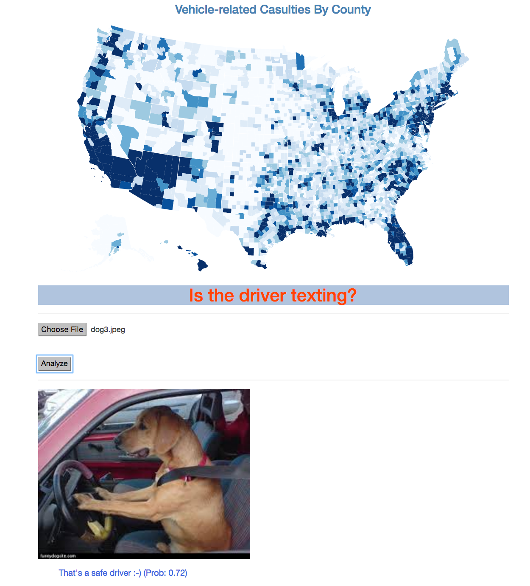

# Detect_Texting_Drivers
Image Classification using Bag of Visual Words    

This goal of this project is to detect drivers that are texting from safe drivers.    
    
Bag of Visual Words is a model that translates local features of an image into a one-dimensional vector.    
1. Extract SIFT features.   
2. Create visual words by clustering similar local features.   
3. Describe image using a histogram of visual words. 
4. Develop a web app to upload an image and classify it at real-time.  

Code for step 1 is included in scripts. Code for steps 2-4 is included in jupyter_notebooks.  

   
